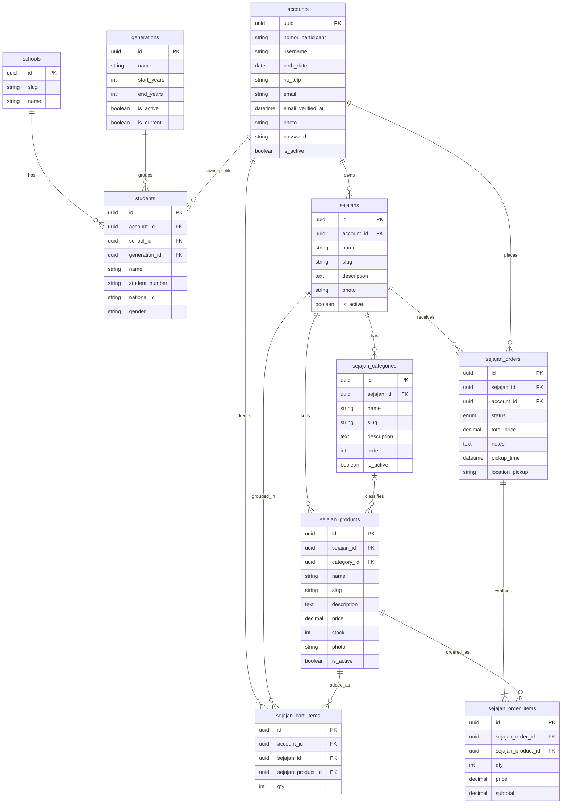
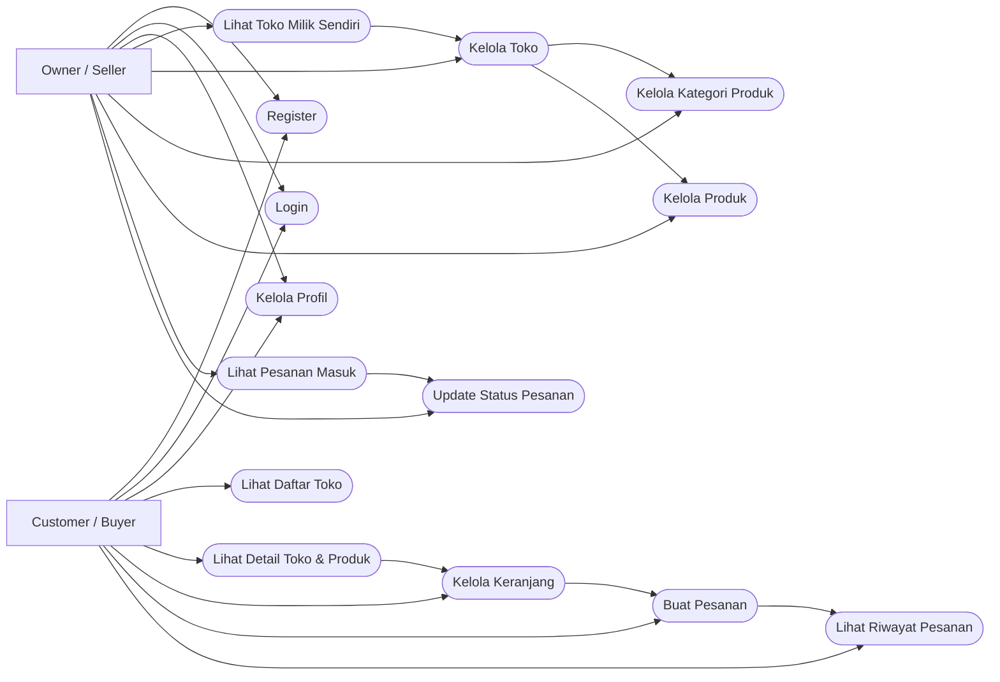

# Selaju System API

**Selaju System** adalah backend API untuk ekosistem aplikasi Selaju - platform terintegrasi yang menyediakan berbagai layanan digital untuk kampus dan pelajar. System ini dibangun dengan Laravel 12 dan menyediakan berbagai modul seperti marketplace pelajar (Sejajan), manajemen konten, sistem autentikasi, dan role-based access control.

Proyek ini merupakan sistem backend yang melayani berbagai aplikasi frontend melalui RESTful API dengan real-time capabilities menggunakan Laravel Reverb untuk notifikasi dan update data secara langsung.

## ✨ Fitur Utama

- **Sejajan Marketplace**: Marketplace khusus pelajar dengan fitur toko, produk, keranjang, dan pemesanan real-time
- **Real-time Notifications**: Notifikasi langsung untuk pesanan baru dan update status menggunakan WebSocket
- **Authentication & Authorization**: Sistem autentikasi berbasis token (Sanctum) dengan role-based permissions
- **Content Management**: Manajemen artikel dan kategori konten
- **Dynamic Menu System**: Sistem menu dinamis berdasarkan permission user
- **Broadcasting Events**: Laravel Reverb untuk komunikasi real-time antara buyer dan seller

## 🚀 Cara Instalasi

### Persyaratan Sistem

- PHP 8.2+
- Composer
- MySQL 8.0+
- Node.js 18+
- Code Editor

### Langkah Instalasi

1. **Clone Repository**
   ```bash
   git clone <repository-url>
   cd selaju-system
   ```

2. **Install Dependencies**
   ```bash
   composer install
   ```

3. **Setup Environment**
   Salin file `.env.example` ke `.env` dan sesuaikan konfigurasi database:
   ```bash
   cp .env.example .env
   php artisan key:generate
   ```

4. **Setup Database**
   Jalankan migration dan seeder untuk membuat tabel dan data awal:
   ```bash
   php artisan migrate:fresh --seed
   ```

5. **Install Laravel Reverb**
   Install dan setup Reverb untuk fitur real-time:
   ```bash
   php artisan install:broadcasting
   ```

6. **Jalankan Aplikasi**
   Jalankan 3 service berikut di terminal terpisah:
   ```bash
   # Terminal 1: Laravel Server
   composer run dev
   
   # Terminal 2: Reverb WebSocket Server
   php artisan reverb:start
   
   # Terminal 3: Queue Worker
   php artisan queue:work
   ```

## 🔑 Kredensial Default

Gunakan kredensial berikut untuk login sebagai Super Admin:

- **Email**: `dev@gncs.dev`
- **Password**: `programmer123`
- **Role**: Super Admin

## 📡 Dokumentasi API

### Endpoint Utama

#### Authentication
- `POST /api/register` - Registrasi user baru
- `POST /api/login` - Login dan dapatkan token
- `POST /api/logout` - Logout user
- `GET /api/user` - Get data user yang sedang login

#### Sejajan Marketplace
- `GET /api/sejajans` - List semua toko
- `POST /api/sejajans` - Buat toko baru
- `GET /api/sejajans/my-stores` - Toko milik user
- `GET /api/sejajans/{slug}` - Detail toko
- `PUT /api/sejajans/{id}` - Update toko
- `DELETE /api/sejajans/{id}` - Hapus toko

#### Products
- `GET /api/sejajans/{slug}/products` - List produk toko
- `POST /api/sejajans/{slug}/products` - Tambah produk
- `PUT /api/sejajans/{slug}/products/{id}` - Update produk
- `DELETE /api/sejajans/{slug}/products/{id}` - Hapus produk

#### Orders
- `POST /api/sejajans/orders` - Buat pesanan baru
- `GET /api/sejajans/my-orders` - Pesanan user (sebagai buyer)
- `GET /api/sejajans/{slug}/orders` - Pesanan toko (sebagai seller)
- `PUT /api/sejajans/{slug}/orders/{id}/status` - Update status pesanan

#### Cart
- `GET /api/sejajans/cart` - Get keranjang belanja
- `POST /api/sejajans/cart` - Tambah item ke keranjang
- `PATCH /api/sejajans/cart/{id}` - Update quantity item
- `DELETE /api/sejajans/cart/{id}` - Hapus item dari keranjang

### Broadcasting Events

System menggunakan Laravel Reverb untuk real-time notifications:

#### Private Channels
- `orders.buyer.{userId}` - Channel untuk buyer menerima update pesanan
- `orders.seller.{userId}` - Channel untuk seller menerima pesanan baru

#### Events
- `order.new` - Event ketika ada pesanan baru masuk ke toko
- `order.status.updated` - Event ketika status pesanan diubah

## 📊 Struktur Database

### Entity Relationship Diagram (ERD)

Diagram lama masih memakai struktur sebelum refactor `participants -> accounts`.
Di bawah ini ERD yang menyesuaikan migration dan model terbaru untuk modul `Sejajan`.



### UML Diagram

Diagram sebelumnya lebih mirip use case diagram dan masih terlalu umum.
Versi berikut menyesuaikan endpoint dan alur fitur `Sejajan` yang ada di `routes/api.php`.



## 🛠 Tech Stack

- **Framework**: Laravel 12
- **Language**: PHP 8.2+
- **Database**: MySQL 8.0+
- **Authentication**: Laravel Sanctum (Token-based API authentication)
- **Real-time**: Laravel Reverb (WebSocket server untuk broadcasting)
- **ORM**: Eloquent
- **Caching**: Redis (opsional)
- **Queue**: Database/Redis driver untuk async job processing
- **Broadcasting**: Pusher protocol via Reverb
- **File Storage**: Local filesystem dengan configurable path

### Tools & Development
- **Package Manager**: Composer
- **Testing**: PHPUnit
- **Version Control**: Git
- **API Pattern**: RESTful API dengan resource controllers
- **Error Handling**: Global exception handler dengan custom responses

---
**Status**: ✅ Active Development | Laravel 12 | PHP 8.2+
